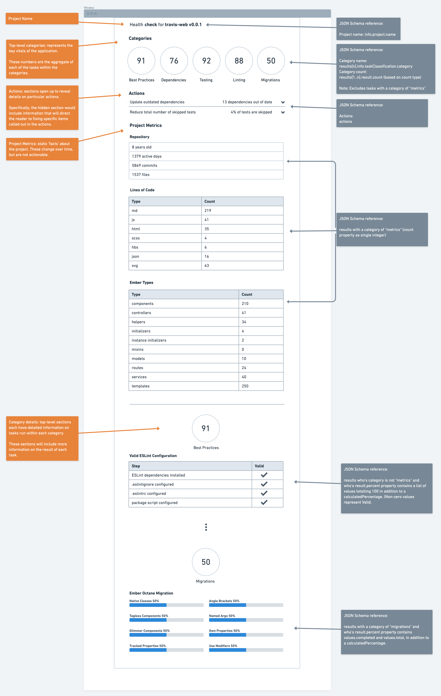

- Feature Name: Task Result JSON Schema
- Start Date: 2020-07-02
- RFC PR: (leave this empty)
- Checkup Issue: (leave this empty)

# Summary

[summary]: #summary

Up to now, Checkup's development has been largely focused on the basic, core feature set that enables experimentation and iteration, end-to-end. At this point, we have a reasonable set of experimental tasks that it's become clear there's a need to standardize the output.

# Motivation

[motivation]: #motivation

Similar to other projects that concern themselves with code quality (eslint, ember-template-lint, etc), we should seek to provide standardized, predictable, and ultimately parsable output from tasks. Adding this additional structure to output data will allow us to adapt Checkup for future use cases.

## Consumption of Generated Data

Checkup's primary use case is to summarize insights through static analysis. As such, its primary consumption modalities are

1. A one-time snapshot report summarizing the data
1. Historical data that can visualize changes over time

Summarization, and the associated insights and actions that are generated from that data, is largely tied to the task's implementation; the task defines what's important information to derive.

Secondary consumption modalities are

1. Richer reporting in the one-time snapshot, where issues can be tied back directly to lines of code in the associated repository
1. The ability to run Checkup in Github pull requests, and annotate files with specific code quality issues
1. Integrate more tightly with IDEs like vscode, where Checkup can be run on the currently open file(s), allowing for inline annotations on code quality issues

These secondary forms of data usage are tied more directly to specific files, and also can potentially duplicate the role of other tools in annotating files' specific issues. We should seek to provide an enhancement in insights over what is provided by established tools such as eslint/ember-template-lint, but not supplant them.

Implementing a more structured approach to data will allow us to provide version guarantees around functionality, and will give users confidence when authoring tasks that we're not going to break their functionality.

Specifically, we want to design a structure for task results that is as generic as possible, allowing for the representation and display of that data to accommodate the use cases referenced above.

# Details

[details]: #details

As previously mentioned, Checkup is similar to, and uses, other static analysis tools such as [eslint](https://eslint.org/) and [ember-template-lint](https://github.com/ember-template-lint/ember-template-lint) to generate its data. While there are similarities, there are also fundamental differences.

## Task based vs. File based

The aforementioned tools mainly operate at the file level, and provide insight into specific files to help guide the user to addressing issues. Checkup, on the other hand, is a task-based tool who's main goal is to aggregate information based on groupings of information defined in tasks. The primary function is the summarization of that data, while the secondary function is to annotate issues at the file level (when running Checkup on a Github PR, or when configured to run in an IDE such as VSCode).

This is mainly due to Checkup's difference in function: insights are gained through the grouping and aggregation of data, and actions are determined by the makeup of that data. While annotating information on files is important, there are already well established tools that do this (the previously mentioned linters), and Checkup should not seek to supplant those tools as this would be a confusing experience to users.

Ultimately, whether Check was to operate against tasks vs. files is relevant but not critical; either mechanism will allow the data to be subsequently formatted for specific purposes.

## Types of Data Gathered by Tasks

Tasks are broken up into a few distinct types

1. Informational (meta) tasks

   Gathers data related to the project, largely irrespective of where that data lives (not concerned with specific files)

   eg. Project info (name, version, etc.) / repository info (git stats)

1. Data gathering tasks

   **Count-based**

   Gathers project structure data that seeks to provide aggregate counts to illuminate the 'shape' of the project

   eg. Project types

   **File-based**

   Gathers info, largely from linters, that give line/column information on specific files

Providing more structure that addresses these differing types of data will allow for a structured approach to the output, allowing for external consumers of the data to have some guarantees when integrating and consuming it.

# Proposal

[proposal]: #proposal

Based on the details listed above, I propose the following:

1. Design of an output schema such that it provides structure, with flexibility, to achieve the above use cases
1. Implementation of utilities that can adapt data gathered from other code quality tools into this schema
1. Schema validation, which ensures tasks return the correctly structured data
1. Provide utilities to reformat the data into a file-based schema to accommodate those use cases.

## Proposed aggregate data schema

The below example illustrates the complete proposed data schema for JSON output. Following the example, each of the composite parts will be explained.

<details>
  <summary>Proposed Schema</summary>

```json
{
  "$schema": "http://json-schema.org/draft-04/schema#",
  "type": "object",
  "properties": {
    "info": {
      "type": "object",
      "properties": {
        "project": {
          "type": "object",
          "properties": {
            "name": {
              "type": "string"
            },
            "version": {
              "type": "string"
            },
            "repository": {
              "type": "object",
              "properties": {
                "totalCommits": {
                  "type": "integer"
                },
                "totalFiles": {
                  "type": "integer"
                },
                "age": {
                  "type": "string"
                },
                "activeDays": {
                  "type": "string"
                }
              },
              "required": ["totalCommits", "totalFiles", "age", "activeDays"]
            },
            "analyzedFilesCount": {
              "type": "integer"
            }
          },
          "required": ["name", "version", "repository", "analyzedFilesCount"]
        },
        "cli": {
          "type": "object",
          "properties": {
            "schema": {
              "type": "integer"
            },
            "configHash": {
              "type": "string"
            },
            "version": {
              "type": "string"
            }
          },
          "required": ["schema", "configHash", "version"]
        }
      }
    },
    "results": {
      "type": "array",
      "items": [
        {
          "type": "object",
          "properties": {
            "info": {
              "type": "object",
              "properties": {
                "taskName": {
                  "type": "string"
                },
                "friendlyTaskName": {
                  "type": "string"
                },
                "taskClassification": {
                  "type": "object",
                  "properties": {
                    "category": {
                      "type": "string"
                    },
                    "group": {
                      "type": "string"
                    }
                  },
                  "required": ["category"]
                }
              },
              "required": ["taskName", "friendlyTaskName", "taskClassification"]
            },
            "result": {
              "type": "array",
              "items": [
                {
                  "type": "object",
                  "properties": {
                    "key": {
                      "type": "string"
                    },
                    "count": { "type": "integer" },
                    "percent": {
                      "oneOf": [
                        {
                          "type": "object",
                          "properties": {
                            "values": {
                              "type": "object",
                              "properties": {
                                "completed": {
                                  "type": "integer"
                                }
                              },
                              "required": ["completed", "total"]
                            },
                            "total": {
                              "type": "integer"
                            },
                            "calculatedPercent": {
                              "type": "integer"
                            }
                          },
                          "required": ["values", "calculcatedPercent"]
                        },
                        {
                          "type": "object",
                          "properties": {
                            "values": {
                              "type": "object",
                              "patternProperties": {
                                ".*": { "type": "integer" }
                              }
                            },
                            "total": {
                              "type": "integer"
                            },
                            "calculatedPercent": {
                              "type": "integer"
                            }
                          },
                          "required": ["values", "calculcatedPercent"]
                        }
                      ]
                    },
                    "data": {
                      "type": "array",
                      "items": {
                        "oneOf": [
                          {
                            "type": "string"
                          },
                          {
                            "type": "object"
                          }
                        ]
                      }
                    }
                  },
                  "required": ["key", "count", "data"]
                }
              ]
            }
          }
        }
      ]
    },
    "errors": {
      "type": "array",
      "items": {
        "type": "object",
        "properties": {
          "taskName": {
            "type": "string"
          },
          "error": {
            "type": "string"
          }
        },
        "required": ["taskName", "error"]
      }
    },
    "actions": {
      "type": "array",
      "items": [
        {
          "type": "object",
          "properties": {
            "name": {
              "type": "string"
            },
            "summary": {
              "type": "string"
            },
            "details": {
              "type": "string"
            },
            "defaultThreshold": {
              "type": "number"
            },
            "items": {
              "type": "array",
              "items": {}
            },
            "input": {
              "type": "number"
            }
          },
          "required": [
            "name",
            "summary",
            "details",
            "defaultThreshold",
            "items",
            "input"
          ]
        }
      ]
    }
  },
  "required": ["info", "results", "errors", "actions"]
}
```

</details>

<details>
  <summary>TypeScript Interfaces</summary>

```ts
import { Action, TaskError, TaskMetaData } from './tasks';

export interface MigrationCompletion {
  values: {
    completed: number;
  };
  total: number;
  calculatedPercent?: number;
}

export interface MultiStepCompletion {
  values: Record<string, number>;
  total: 100;
  calculatedPercent?: number;
}

export interface CheckupResult {
  info: {
    project: {
      name: string;
      version: string;
      repository: {
        totalCommits: number;
        totalFiles: number;
        age: string;
        activeDays: string;
      };
    };
    cli: {
      schema: number;
      configHash: string;
      version: string;
    };
    analyzedFilesCount: number;
  };
  results: [
    {
      info: TaskMetaData;
      result: [
        {
          key: string;
          count?: number;
          percent?: MigrationCompletion | MultiStepCompletion;
          data: Array<string | object>;
        }
      ];
    }
  ];
  errors: TaskError[];
  actions: Action[];
}
```

</details>

### Schema Structure

```json
{
  "info": {
    //...
  },

  "results": [
    //...
  ],

  "errors": [
    //...
  ],

  "actions": [
    //...
  ]
}
```

#### `info` property

Contains information related to the project that was run.

#### `results` property

Contains a list of the task results from each task.

#### `errors` property

Contains a list of errors generated from tasks during invocation.

#### `actions` property

Contains any actions triggered as a result of running a task.

## `info` property schema

<details>
  <summary>Schema fragment</summary>

```json
"info": {
  "type": "object",
  "properties": {
    "project": {
      "type": "object",
      "properties": {
        "name": {
          "type": "string"
        },
        "version": {
          "type": "string"
        },
        "repository": {
          "type": "object",
          "properties": {
            "totalCommits": {
              "type": "integer"
            },
            "totalFiles": {
              "type": "integer"
            },
            "age": {
              "type": "string"
            },
            "activeDays": {
              "type": "string"
            }
          },
          "required": ["totalCommits", "totalFiles", "age", "activeDays"]
        },
        "analyzedFilesCount": {
          "type": "integer"
        }
      },
      "required": ["name", "version", "repository", "analyzedFilesCount"]
    },
    "cli": {
      "type": "object",
      "properties": {
        "schema": {
          "type": "integer"
        },
        "configHash": {
          "type": "string"
        },
        "version": {
          "type": "string"
        }
      },
      "required": ["schema", "configHash", "version"]
    }
  }
}
```

</details>

<details>
  <summary>Example</summary>

```json
"info": {
  "project": {
    "name": "travis",
    "version": "0.0.1",
    "repository": {
      "totalCommits": 5869,
      "totalFiles": 1537,
      "age": "8 years",
      "activeDays": "1379"
    },
    "analyzedFilesCount": 1538
  },
  "cli": {
    "schema": 1,
    "configHash": "73249aa52d0783c15cd068a47a808543",
    "version": "0.2.2"
  }
}
```

</details>

## `results` property schema

<details>
  <summary>Schema fragment</summary>

```json
"result": {
  "type": "array",
  "items": [
    {
      "type": "object",
      "properties": {
        "key": {
          "type": "string"
        },
        "count": { "type": "integer" },
        "percent": {
          "oneOf": [
            {
              "type": "object",
              "properties": {
                "values": {
                  "type": "object",
                  "properties": {
                    "completed": {
                      "type": "integer"
                    }
                  },
                  "required": ["completed"]
                },
                "total": {
                  "type": "integer"
                },
                "calculatedPercent": {
                  "type": "integer"
                }
              },
              "required": ["values", "calculcatedPercent", "total"]
            },
            {
              "type": "object",
              "properties": {
                "values": {
                  "type": "object",
                  "patternProperties": {
                    ".*": { "type": "integer" }
                  }
                },
                "total": {
                  "type": "integer"
                },
                "calculatedPercent": {
                  "type": "integer"
                }
              },
              "required": ["values", "calculcatedPercent", "total"]
            }
          ]
        },
        "data": {
          "type": "array",
          "items": {
            "oneOf": [
              {
                "type": "string"
              },
              {
                "type": "object"
              }
            ]
          }
        }
      },
      "required": ["key", "count", "data"]
    }
  ]
}
```

</details>

### Summary task results

Summary task results (tasks that have a `category` of `metrics`) are strictly informational in nature. They count a particular entity, such as a type, and display that value. Their main purpose is to help give a summary of the _shape_ and _size_ of a project, and to allow you to chart the changes to that _shape_ and _size_ over time.

The summary task results have a simple integer value for the `count` property equivalent to the following:

```json
"count": { "type": "integer" }
```

<details>
  <summary>Summary task result example</summary>

```json
"results": [
  {
    "info": {
      "taskName": "ember-types",
      "friendlyTaskName": "Ember Types",
      "taskClassification": {
        "category": "metrics",
        "group": "ember"
      }
    },
    "result": [
      {
        "key": "components",
        "count": 11,
        "data": [
          "app/components/account-token.js",
          "app/components/active-repo-count.js",
          "app/components/add-cron-job.js",
          "app/components/add-env-var.js",
          "app/components/add-ssh-key.js",
          "app/components/annotated-yaml.js",
          "app/components/beta-feature.js",
          "app/components/billing-summary-status.js",
          "app/components/billing/account.js",
          "app/components/billing/address.js",
          "app/components/billing/authorization.js"
        ]
      },
      {
        "key": "services",
        "count": 9,
        "data": [
          "app/services/accounts.js",
          "app/services/ajax.js",
          "app/services/animation.js",
          "app/services/api.js",
          "app/services/app-loading.js",
          "app/services/auth.js",
          "app/services/broadcasts.js",
          "app/services/external-links.js",
          "app/services/feature-flags.js"
        ]
      },
      {
        "key": "mixins",
        "count": 9,
        "data": [
          "app/mixins/branch-searching.js",
          "app/mixins/build-favicon.js",
          "app/mixins/builds/load-more.js",
          "app/mixins/components/form-select.js",
          "app/mixins/components/with-config-validation.js",
          "app/mixins/controller/account-repositories.js",
          "app/mixins/controller/billing.js",
          "app/mixins/duration-attributes.js",
          "app/mixins/duration-calculations.js",
          "app/mixins/polling.js"
        ]
      }
    ]
  }
]
```

</details>

#### Migration task results

Migration task results (tasks that have a `category` of `migration`) determine the completion percentage of a migration. They're intended to help chart the progress of a migration, and help quantify the overall state.

The `percent` property contains a hash of values, which are used to determine the `calculatedPercent`.

The `calculatedPercent` can be calculated using the following:

```ts
let { completed, total } = percent.values;

let calculatedPercent = Math.round(
  (percent.values.completed / percent.total) * 100
);
```

The migration task results' `percent` property is equivalent to the following:

```json
"percent": {
  "type": "object",
  "properties": {
    "values": {
      "type": "object",
      "properties": {
        "completed": {
          "type": "integer"
        }
      },
      "required": ["completed"]
    },
    "total": {
      "type": "integer"
    },
    "calculatedPercent": {
      "type": "integer"
    }
  },
  "required": ["values", "calculcatedPercent", "total"]
}
```

<details>
  <summary>Migration task result example</summary>

```json
"results": [
  {
    "meta": {
      "taskName": "octane-migration-status",
      "friendlyTaskName": "Ember Octane Migration Status",
      "taskClassification": {
        "category": "migrations",
        "group": "ember"
      }
    },
    "result": [
      {
        "key": "Native Classes",
        "percent": {
          "values": {
            "completed": 0
          },
          "total": 357,
          "calculatedPercent": 0
        }
        "data": [
          {
            "filePath": "/Users/scalvert/Workspace/travis-web/app/adapters/application.js",
            "messages": [
              {
                "ruleId": "ember/no-actions-hash",
                "message": "Definition for rule 'ember/no-actions-hash' was not found.",
                "line": 1,
                "column": 1,
                "endLine": 1,
                "endColumn": 2,
                "severity": 2,
                "nodeType": null
              },
              {
                "ruleId": "ember/no-classic-classes",
                "message": "Definition for rule 'ember/no-classic-classes' was not found.",
                "line": 1,
                "column": 1,
                "endLine": 1,
                "endColumn": 2,
                "severity": 2,
                "nodeType": null
              },
              {
                "ruleId": "ember/no-classic-components",
                "message": "Definition for rule 'ember/no-classic-components' was not found.",
                "line": 1,
                "column": 1,
                "endLine": 1,
                "endColumn": 2,
                "severity": 2,
                "nodeType": null
              },
              {
                "ruleId": "ember/no-component-lifecycle-hooks",
                "message": "Definition for rule 'ember/no-component-lifecycle-hooks' was not found.",
                "line": 1,
                "column": 1,
                "endLine": 1,
                "endColumn": 2,
                "severity": 2,
                "nodeType": null
              },
              {
                "ruleId": "ember/no-computed-properties-in-native-classes",
                "message": "Definition for rule 'ember/no-computed-properties-in-native-classes' was not found.",
                "line": 1,
                "column": 1,
                "endLine": 1,
                "endColumn": 2,
                "severity": 2,
                "nodeType": null
              },
              {
                "ruleId": "ember/no-get-with-default",
                "message": "Definition for rule 'ember/no-get-with-default' was not found.",
                "line": 1,
                "column": 1,
                "endLine": 1,
                "endColumn": 2,
                "severity": 2,
                "nodeType": null
              },
              {
                "ruleId": "ember/require-tagless-components",
                "message": "Definition for rule 'ember/require-tagless-components' was not found.",
                "line": 1,
                "column": 1,
                "endLine": 1,
                "endColumn": 2,
                "severity": 2,
                "nodeType": null
              },
              {
                "ruleId": "ember/no-mixins",
                "message": "Definition for rule 'ember/no-mixins' was not found.",
                "line": 1,
                "column": 1,
                "endLine": 1,
                "endColumn": 2,
                "severity": 2,
                "nodeType": null
              }
            ],
            "errorCount": 8,
            "warningCount": 0,
            "fixableErrorCount": 0,
            "fixableWarningCount": 0,
            "source": "import config from 'travis/config/environment';\nimport ActiveModelAdapter from 'active-model-adapter';\nimport { inject as service } from '@ember/service';\n\nexport default ActiveModelAdapter.extend({\n  auth: service(),\n  features: service(),\n\n  host: config.apiEndpoint,\n  coalesceFindRequests: true,\n\n  // Before Ember Data 2.0 the default behaviour of running `findAll` was to get\n  // new records only when there're no records in the store. This will change\n  // to a different strategy in 2.0: when you run `findAll` it will not get any\n  // new data initially, but it will try loading new data in the background.\n  //\n  // I'm disabling the new behaviour for now.\n  shouldBackgroundReloadRecord() {\n    return false;\n  },\n\n  ajaxOptions() {\n    let hash = this._super(...arguments);\n    hash.headers = hash.headers || {};\n    hash.headers['accept'] = 'application/json; version=2';\n    hash.headers['X-Client-Release'] = config.release;\n\n    let token = this.get('auth.token');\n    if (token) {\n      if (!hash.headers['Authorization']) {\n        hash.headers['Authorization'] = `token ${token}`;\n      }\n    }\n\n    return hash;\n  },\n\n  findMany(store, type, ids) {\n    return this.ajax(this.buildURL(type.modelName), 'GET', {\n      data: {\n        ids: ids\n      }\n    });\n  },\n\n  handleResponse(status, headers, payload) {\n    if (status > 299) {\n      if (this.get('features.debugLogging')) {\n        // eslint-disable-next-line\n        console.log(\"[ERROR] API responded with an error (\" + status + \"): \" + (JSON.stringify(payload)));\n      }\n    }\n\n    return this._super(...arguments);\n  },\n});\n"
          }
        ]
      }
    ]
  }
]
```

</details>

### Multi-step validation task

Multi-step validation tasks chart the overall completion of a multi-step task. These are used to determine the overall completion of a task that requires multiple, disparate steps to finish. Those individual steps, each given a weighed value, ultimately add up to 100, denoting a task as "completed".

Due to this requirement, task authors need to ensure a few things:

1. Determine the steps that comprise whether a task is "completed" or not
1. Assign a weighted value (heavier weight to a step that is proportionally more important, or even weights if all steps are of equal importance)
1. All weights total 100, which is used to derive the `calculatedPercent` property. **Note**: this requirement should be enforced through runtime validation.

The `calculatedPercent` can be calculated using the following:

```ts
let values = Object.values(percent.values).reduce(
  (total, value) => total + value,
  0
);

let calculatedPercent = Math.round((values / percent.total) * 100);
```

The multi-step validation task results have a `percent` property equivalent to the following:

```json
"percent": {
  "type": "object",
  "properties": {
    "values": {
      "type": "object",
      "patternProperties": {
        ".*": { "type": "integer" }
      }
    },
    "total": {
      "type": "integer"
    },
    "calculatedPercent": {
      "type": "integer"
    }
  },
  "required": ["values", "calculcatedPercent"]
}
```

<details>
  <summary>Multi-step validation task result example</summary>

```json
"results": [
  {
    "meta": {
      "taskName": "valid-eslint-configuration",
      "friendlyTaskName": "Valid ESLint Configuration",
      "taskClassification": {
        "category": "best practices"
      }
    },
    "result": [
      {
        "key": "Valid ESLint Configuration",
        "percent": {
          "values": {
            "correctDependenciesInstalled": 20,
            "correctESLintIgnore": 20,
            "correctESLintConfig": 60
          },
          "total": 100,
          "calculatedPercent": 100
        }
        "data": [
        ]
      }
    ]
  }
]
```

</details>

## `errors` property schema

<details>
  <summary>Schema fragment</summary>

```json
"errors": {
  "type": "array",
  "items": {
    "type": "object",
    "properties": {
      "taskName": {
        "type": "string"
      },
      "error": {
        "type": "string"
      }
    },
    "required": [
      "taskName",
      "error"
    ]
  }
}
```

</details>

<details>
  <summary>Example</summary>

```json
"errors": [
  { "taskName": "lines-of-code", "error": "Uncaught TypeError: Cannot read property." }
],
```

</details>

## `actions` property schema

<details>
  <summary>Schema fragment</summary>

```json
"actions": {
  "type": "array",
  "items": [
    {
      "type": "object",
      "properties": {
        "name": {
          "type": "string"
        },
        "summary": {
          "type": "string"
        },
        "details": {
          "type": "string"
        },
        "defaultThreshold": {
          "type": "number"
        },
        "items": {
          "type": "array",
          "items": {}
        },
        "input": {
          "type": "number"
        }
      },
      "required": [
        "name",
        "summary",
        "details",
        "defaultThreshold",
        "items",
        "input"
      ]
    }
  ]
}
```

</details>

<details>
  <summary>Example</summary>

```json
"actions": [
    {
      "name": "reduce-outdated-major-dependencies",
      "summary": "Update outdated major versions",
      "details": "25 major versions outdated",
      "defaultThreshold": 0.05,
      "items": [],
      "input": 0.21739130434782608
    },
    {
      "name": "reduce-outdated-minor-dependencies",
      "summary": "Update outdated minor versions",
      "details": "21 minor versions outdated",
      "defaultThreshold": 0.05,
      "items": [],
      "input": 0.1826086956521739
    }
  ]
```

</details>

## Associating data to UI

The following wireframe of the proposed HTML reporter demonstrates the usage of the above schema in a practical example.



It's almost certain that more detail will emerge that will require slight adjustments to the schema. This is expected, and anticipated.

## Adapting data for other uses

The above schema is primarily focused on addressing the [two major use cases](#motivation). While the primary goal of Checkup is to display aggregate information gathered from the configured tasks, the secondary use cases that require grouping and annotation at the file level can still be supported.

Transforming the data from the task-based form to the file-based form will require a utility, and that should be written and published by Checkup for use by consumers.

# Unresolved questions

[unresolved]: #unresolved-questions

- What parts of the design do you expect to resolve through the RFC process before this gets merged?
- What parts of the design do you expect to resolve through the implementation of this feature before stabilization?
- What related issues do you consider out of scope for this RFC that could be addressed in the future independently of the solution that comes out of this RFC?
